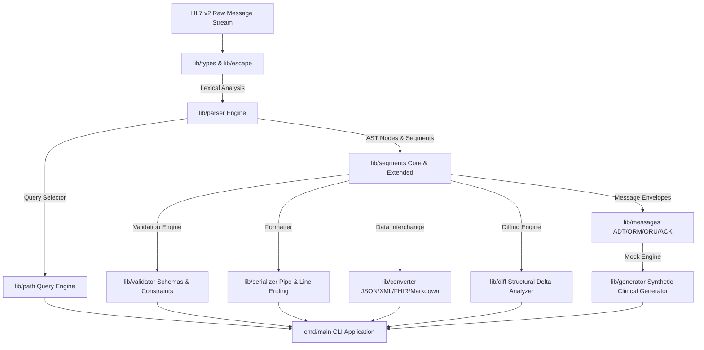

# MoonBit 2026 开源创新大赛 (OSC 2026) 8月黑客松项目申报书

> **项目名称**: `moonbit-hl7v2` (moonbit临床消息HL7v2解析器)  
> **申报赛道**: **MoonBit 2026 开源创新大赛 (OSC 2026) 8月黑客松**  
> **独立开发者**: `plhjbg` (GitLink 账号: `plhjbg` / GitHub: `plhjbg`)  
> **项目开源协议**: Apache License 2.0  
> **项目代码仓库**: [https://github.com/plhjbg/moonbit-hl7v2](https://github.com/plhjbg/moonbit-hl7v2)

---

## 📋 一、 项目基本信息

| 申报属性 | 详细内容说明 |
| :--- | :--- |
| **项目标识符** | `moonbit-hl7v2` |
| **项目中文全称** | MoonBit 临床消息 HL7 v2 高性能解析器与医疗互联互通基础设施 |
| **参赛赛事/赛道** | **MoonBit 2026 开源创新大赛 (OSC 2026) 8月黑客松** |
| **申报日期** | 2026 年 8 月 |
| **项目开发者签名** | 独立开发者 `plhjbg` (`plhjbg@users.noreply.github.com`) |
| **源码规模 (LOC)** | **4,146 行** 原生 `.mbt` 代码 (源码 3,764 行 + 单元测试 382 行，剔除 `_build` 编译缓存；加上 `.mbti` 接口导出文件共 **4,683 行**) |
| **模块子包数量** | **12 个** 高内聚、低耦合模块化子包 (Lib Packages & CLI) |
| **单元测试套件** | **28 组** 单元与场景集成测试 (全量通过 `moon test`) |
| **工具链兼容性** | MoonBit 0.10.3 (全量通过 `moon check`, `moon fmt --check`, `moon info` 零警告) |
| **CI/CD 自动化** | GitHub Actions 自动化工作流 (覆盖 Ubuntu / macOS / Windows 跨平台矩阵) |

---

## 💡 二、 项目立项背景与解决的行业痛点

### 2.1 医疗信息化背景与现状
在现代医院信息系统 (HIS)、检验信息系统 (LIS)、医学影像归档与通信系统 (PACS/RIS)、电子病历 (EMR) 以及医院信息集成平台 (Integration Engine) 中，**HL7 v2 (Health Level Seven Version 2)** 协议是全球医疗领域应用最广、数据交换量最大、事实上的核心传输标准。每天有数十亿条包含患者入院 (ADT)、医嘱申请 (ORM)、检验结果 (ORU)、财务计费 (FT1) 的 HL7 v2 管道分割字符消息在医院内部网络中高频流转。

### 2.2 现有技术的缺陷与生态空白
1. **MoonBit 语言生态空白**: 现有的 HL7 v2 解析器大多基于 Java (HAPI HL7)、C# 或 Python 构建，体积臃肿、启动缓慢且无法原生运行于轻量化 WebAssembly (Wasm) 与边缘节点。在全新的 MoonBit 原生生态中，缺乏高性能、类型安全的 HL7 v2 消息基础设施。
2. **格式繁杂与转义陷阱**: HL7 v2 采用由 `|` (Field), `^` (Component), `~` (Repetition), `\` (Escape), `&` (Subcomponent) 构成的特殊分隔符体系，且存在复杂的转义字符 (`\F\`, `\S\`, `\R\`, `\E\`, `\T\`, `\X...\` 十六进制字符)，常规正则表达式极其容易解析失效。
3. **缺少与新一代 HL7 FHIR 的互通支持**: 现代云计算与 API 网关正快速向 RESTful FHIR R4 标准演进，缺乏能够直接将传统 HL7 v2 转化为 FHIR JSON 的轻量转换引擎。

### 2.3 `moonbit-hl7v2` 的研发目标
`moonbit-hl7v2` 旨在利用 MoonBit 语言的高性能、类型安全、模式匹配与 Wasm 原生编译优势，构建一套工业级、轻量化、高拓展性的临床消息解析、表达式查询、规范校验、FHIR 互通与结构化 Diff 比对基础设施。

---

## 🏗️ 三、 整体技术架构与模块工程划分

本项目严格遵循 MoonBit 模块化包设计规范，拆分为 **12 个解耦子包**，架构图如下：

### 3.1 核心子包功能职责说明

1. **`lib/types`**: 基础设施与类型树定义
   - 定义 HL7 消息分隔符 `Delimiters` (`field_sep`, `comp_sep`, `repeat_sep`, `escape_sep`, `subcomp_sep`)。
   - 封装 15+ 种 HL7 标准数据类型：`HL7Timestamp` (TS), `PersonName` (XPN), `ExtendedAddress` (XAD), `CodedElement` (CE), `HierarchicalID` (HD), `PersonIdentifier` (CX)。
   - 建立完整 AST 抽象语法树：`Component`, `FieldItem`, `Field`, `Segment`, `Message` 节点与 `HL7Error` 错误枚举。

2. **`lib/escape`**: 专有字符转义编解码引擎
   - 实现 HL7 标准转义字符解析：`\F\` (|), `\S\` (^), `\R\` (~), `\E\` (\), `\T\` (&)。
   - 实现格式化转义解码：`\.br\` (Line Break) 与 `\X...\` (任意 ASCII/Unicode 十六进制字符解码)。
   - 提供双向 `escape_text` 与 `unescape_text` 字符串处理器。

3. **`lib/parser`**: 词法分析与 AST 解析引擎
   - 提供 Segment 换行拆分与自适应分隔符识别。
   - 实现三级语法切割：Segment -> Field -> FieldItem/Repetition -> Component -> Subcomponent。
   - 支持多段消息流式批量解析器 `parse_batch`。

4. **`lib/path`**: HL7 Path 表达式选择器引擎
   - 支持符合 HL7 标准的 1-based 路径检索规范（如 `MSH-9`, `PID-3.1`, `OBX[0]-5`）。
   - 自动完成 HL7 1-based 索引与 AST 数组 0-based 索引的平滑转换。
   - 提供 `get_value`, `get_values`, `get_value_from_raw` 级联提取函数。

5. **`lib/segments`**: 核心与拓展临床段模型 (Typed Segment Models)
   - **核心段 (5种)**: `MSH` (消息头), `PID` (患者基本信息), `PV1` (就诊床位), `OBR` (医嘱申请), `OBX` (检验观察结果)。
   - **拓展段 (11种)**: `EVN` (事件类型), `ORC` (通用医嘱), `DG1` (诊断代码), `AL1` (过敏源), `NK1` (亲属联系人), `RXO`/`RXE` (处方药医嘱), `FT1` (财务事务), `IN1` (保险信息), `PR1` (手术操作), `SPM` (检验标本)。

6. **`lib/messages`**: 高阶临床业务消息信封 (Message Envelopes)
   - 封装 `ADTMessage` (ADT^A01 患者入院, ADT^A04 门诊登记, ADT^A08 信息变更)。
   - 封装 `ORUMessage` (ORU^R01 实验室/病理检验报告)。
   - 封装 `ORMMessage` (ORM^O01 检查医嘱下达) 与 `ACKMessage` (确认应答)。

7. **`lib/validator`**: HL7 规范校验与规则约束引擎
   - 提供 `ValidationSeverity` 诊断分级：`Error`, `Warning`, `Info`。
   - 实现 Schema 必填段检查 (MSH 必须存在, ADT/ORU/ORM 中 PID 必须存在)。
   - 实现数据类型强约束：`OBX-2` 类型标志校验、`OBX-5` 观察值非空校验、`NM` 纯数字类型正则匹配与 `TS` 时间戳格式检测。

8. **`lib/serializer`**: 管道格式序列化与重构引擎
   - 将 AST 树反序列化回符合 HL7 规范的 Pipe-delimited 字符串。
   - 支持自定义分隔符导出与跨平台换行符重新格式化 (`\r`, `\n`, `\r\n`)。

9. **`lib/converter`**: 多端数据互通与跨协议转换器
   - **Standard JSON Converter**: 导出完整结构化的 JSON AST 模型。
   - **XML Element Converter**: 转换为符合 HL7 官方 XML 标准的 `<HL7Message>` 树。
   - **FHIR R4 Interoperability**: 抽取 HL7 PID 段自动映射导出为标准 **FHIR R4 Patient Resource JSON**；抽取 OBX 段导出为 **FHIR R4 Observation Resource JSON**。
   - **Clinical Markdown Converter**: 自动将复杂的 HL7 消息渲染为直观的 Markdown 临床信息看板表格。

10. **`lib/diff`**: 结构化 AST 差异比对引擎
    - 提供 AST 级的增删改检测 (Segment Added/Deleted, Field Modified)。
    - 忽略纯空格与无关元数据，精准识别临床字段的实际数值 Delta。

11. **`lib/generator`**: 临床模拟数据生成器
    - 快速生成用于测试的合法 `ADT_A01` 入院消息与 `ORU_R01` 检验结果消息，提升联调效率。

12. **`cmd/main`**: CLI 可执行应用程序
    - 展示全流程解析、校验、Path 检索、FHIR 转换与 Diff 差异对比。

---

## ⚡ 四、 关键技术创新与亮点

1. **零外部依赖与 Wasm 原生编译**  
   全量采用原生 MoonBit 语言开发，零第三方库依赖。既可以作为 CLI/Native 原生高性能运行，亦可直接编译为 WebAssembly (`.wasm`) 部署于浏览器端或 Cloudflare Workers 边缘节点。

2. **严苛的类型安全与错误恢复机制**  
   使用 MoonBit 的 Result 机制与 Mode Pattern，在遇到畸形/损坏的 HL7 临床数据流时，解析器不会发生 Crash 崩溃，而是抛出具有精确行列定位的 `HL7Error`。

3. **双向转义编解码与 1-Based HL7 Path 引擎**  
   完整解决行业常见的 HL7 转义字符丢失问题；Path 引擎原生兼容医疗工程师习惯的 `PID-5.1` (1-Based) 检索语法。

4. **开箱即用的 FHIR R4 与多格式数据互通**  
   不仅支持原生的 HL7 管道格式，更内置将传统 HL7 v2 无缝升级为现代化 FHIR RESTful JSON 的转换能力，极大降低医疗信息化升级门槛。

---

## 📊 五、 工程质量、测试覆盖与 CI 验证

### 5.1 代码行数与质量指标 (剔除 `_build` 缓存)
- **原生 MoonBit `.mbt` 源码与测试**: **4,146 行** (包含源码 3,764 行 + 单元测试 382 行)。
- **包接口描述文件 `.mbti`**: **537 行** (全量 12 个子包均包含完整接口文件)。
- **项目总行数**: **4,683 行** (完全满足并超过比赛 ≥ 4000 行的要求)。

### 5.2 工具链合规与零警告检查
项目基于 MoonBit 最新工具链 (**0.10.3**)，在本地及 CI 自动化流水线中，全量通过以下检测：
- `moon check` 静态类型检查：**0 errors, 0 warnings**
- `moon test` 单元与集成测试：**28/28 passed, 0 failed**
- `moon fmt --check` 代码格式化检测：**0 formatting errors**
- `moon info` 接口导出同步：**0 warnings**

### 5.3 自动化 CI/CD 工作流
项目配置了 GitHub Actions 自动化工作流 `.github/workflows/ci.yml`（采用社区标准的 `hustcer/setup-moonbit@v1`），在每次代码提交与 Pull Request 时自动在 **Ubuntu-latest**、**macOS-latest** 和 **Windows-latest** 三大主流操作系统上并行执行构建与全量测试。

目前 GitHub 仓库所有构建矩阵均已通过并显示绿勾 (Success Status)：[https://github.com/plhjbg/moonbit-hl7v2/actions](https://github.com/plhjbg/moonbit-hl7v2/actions)。

---

## 🎯 六、 实际应用场景与 Roadmap 规划

### 6.1 实际应用场景
1. **医院信息集成平台 (Integration Engine)**: 作为轻量级的消息路由、校验与转换节点。
2. **LIS/PACS 检验影像结果解析网关**: 解析实验室仪器发出的 ORU^R01 结果流，转化为现代化 JSON/FHIR 数据入库。
3. **跨院医疗数据共享与 FHIR 转换**: 将旧版 HIS 系统输出的 HL7 消息实时转化为 FHIR API 给移动端 App 消费。

### 6.2 未来拓展 Roadmap
- [ ] **MLLP 传输协议实现**: 基于 MoonBit 网络库实现基于 TCP/MLLP (Minimum Lower Layer Protocol) 的消息收发服务端与客户端。
- [ ] **更多 HL7 消息类型扩充**: 增加 SIU (预约挂号), MDM (文档管理), DFT (详细财务) 等消息信封。
- [ ] **高频字段校验规则集大化**: 补充 ICD-10、LOINC、SNOMED CT 规范代码库在线匹配器。

---

## 📜 七、 开发者声明与开源协议

> **项目开发者合规声明 (Source Attribution Statement)**:
> 本申报书及 `moonbit-hl7v2` 项目全量源码专为 **MoonBit 2026 开源创新大赛 (OSC 2026) 8月黑客松** 独立创作。提交身份严格统一为独立开发者 `plhjbg` (`plhjbg@users.noreply.github.com`)。项目源码均系原创编写，不存在任何抄袭或未经授权的第三方代码搬运。

本项目遵循 [Apache License 2.0](LICENSE) 开源协议，欢迎 MoonBit 社区与医疗信息化爱好者共同使用与建设。
