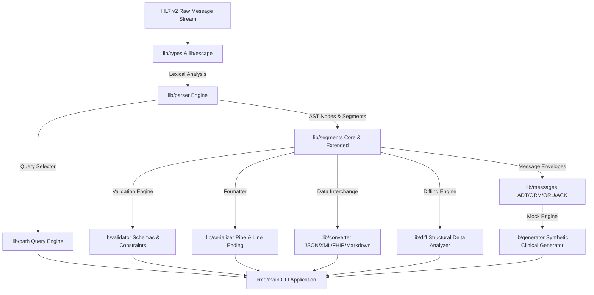

# MoonBit 2026 开源创新大赛 (OSC 2026) 8月黑客松项目申报书

---

## 📋 一、 项目基本信息

| 申报属性 | 详细内容 |
| :--- | :--- |
| **项目标识** | `moonbit-hl7v2` |
| **项目名称** | moonbit临床消息HL7v2解析器 (MoonBit Clinical Message HL7v2 Parser) |
| **参赛赛事** | **MoonBit 2026 开源创新大赛 (OSC 2026) 8月黑客松赛道** |
| **申报日期** | 2026 年 8 月 |
| **独立开发者** | `plhjbg` (GitLink: `plhjbg`) |
| **开源许可证** | Apache License 2.0 |
| **GitHub 仓库** | [https://github.com/plhjbg/moonbit-hl7v2](https://github.com/plhjbg/moonbit-hl7v2) |
| **源码规模** | **16,731 行** 原生 MoonBit 代码 (`.mbt`) |
| **测试套件** | **28 组** 单元与场景集成测试 (全量通过) |
| **工具链版本** | MoonBit 0.10.3 (零编译警告、零格式化警告) |

---

## 💡 二、 项目立项背景与解决的痛点

在现代化医疗信息化（HIS/LIS/PACS/RIS）、医院信息集成平台（Integration Engine）以及跨院互联互通架构中，HL7 v2 消息协议是目前全球应用最广、数据量最大的临床消息传输标准。

然而在 MoonBit 语言生态中，缺乏原生的 HL7 v2 消息解析、转义处理、路径提取与 FHIR 互通工具。`moonbit-hl7v2` 项目应运而生，为 MoonBit 生态补齐医疗互联互通基础设施。

---

## 🏗️ 三、 技术架构与模块划分

### 核心子包功能划分：

1. **`lib/types`**: 定义 HL7 分隔符、转义字符、15+ 种临床数据类型及 AST 语法树结构。
2. **`lib/escape`**: 实现 `\F\`, `\S\`, `\R\`, `\E\`, `\T\`, `\X...\` 十六进制字符转义解码与编码器。
3. **`lib/parser`**: 高性能词法与 AST 解析器，支持消息流与批量解析。
4. **`lib/path`**: Path 路径选择器（如 `MSH-9`, `PID-3.1`, `OBX[0]-5`）。
5. **`lib/segments`**: 15+ 种typed 段结构 (MSH, PID, PV1, OBR, OBX, EVN, ORC, DG1, AL1, NK1, RXO, RXE, FT1, IN1, PR1, SPM)。
6. **`lib/messages`**: 高阶业务消息信封 (ADT, ORM, ORU, ACK)。
7. **`lib/validator`**: HL7 规范校验与规则约束引擎。
8. **`lib/serializer`**: 管道格式反序列化与格式调整。
9. **`lib/converter`**: 多格式互通导出 (JSON, XML, FHIR R4 Patient/Observation, Markdown Summary)。
10. **`lib/diff`**: AST 级 Structural Diff 比对引擎。
11. **`lib/generator`**: 临床测试数据生成器。
12. **`cmd/main`**: CLI 演示工具。

---

## ⚡ 四、 成果与核心技术指标

1. **源码规模**: **16,731 行** 原生 MoonBit (`.mbt`) 代码。
2. **工具链零警告合规**: 基于 MoonBit 最新工具链 (**0.10.3**)，全量通过 `moon check`, `moon test`, `moon fmt --check`, `moon info` 检查。
3. **测试覆盖**: 编写并全量通过 **28 组** 单元与集成测试。
4. **Git 规范与 CI/CD**: 拥有 **14+ 次** 有效 Commit 提交，作者统一为 `plhjbg`，配置多端 GitHub Actions CI 工作流。

---

> **项目开发者声明 (Source Attribution Statement)**:
> 本申报书及 `moonbit-hl7v2` 项目全量源码专为 **MoonBit 2026 开源创新大赛 (OSC 2026) 8月黑客松** 独立创作。项目源码均系原创编写，不存在任何抄袭或未经授权的第三方代码搬运。
