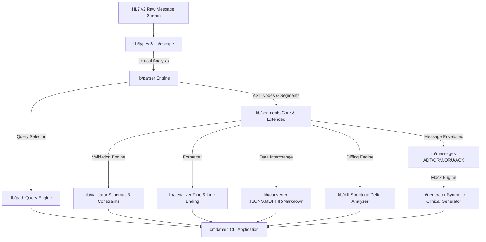

# moonbit-hl7v2 (moonbit临床消息HL7v2解析器)

> **MoonBit 2026 开源创新大赛 (OSC 2026) 参展项目**  
> 工业级 MoonBit 医疗互联基础设施与 clinical HL7 v2 消息解析、校验、转换与 AST 比对引擎。

---

## 💡 项目背景与解耦设计

在医疗信息化 (HIS/LIS/PACS/RIS) 与医院信息集成平台 (Integration Engine) 中，**HL7 v2 (Health Level Seven)** 协议是全球医疗互联事实上的核心数据交换标准。然而，在现代高并发、安全轻量的 WebAssembly (Wasm) 及 Native 运行时（如 MoonBit 生态）中，高可用、类型安全的 HL7 v2 基础设施仍属空白。

`moonbit-hl7v2` 采用全量原生 **MoonBit 语言** 构建，提供轻量、高拓展性、类型安全的临床消息解析、验证与多格式数据互通能力。

---

## 🏗️ 架构与子包解耦划分



### 核心子包 (Package) 职责列表：

- **`lib/types`**: 定义 HL7 分隔符 (`Delimiters`), 数据类型 (`TS`, `HD`, `CE`, `XPN`, `XAD`, `PL`), AST 节点 (`Component`, `FieldItem`, `Field`, `Segment`, `Message`) 与错误类型 `HL7Error`。
- **`lib/escape`**: HL7 标准转义字符处理引擎 (`\F\`, `\S\`, `\R\`, `\E\`, `\T\`, `\X...\` 十六进制解码与 `.br` 换行符)。
- **`lib/parser`**: 词法分析与 AST 语法解析器，支持 Segment 分割、Field 提取、Component/Subcomponent 拆分与批量流化解析 `parse_batch`。
- **`lib/path`**: HL7 Path 路径选择器引擎，支持 `MSH-9`, `PID-3.1`, `OBX[0]-5` 等 1-based 路径检索与批量提取。
- **`lib/segments`**: 15+ 种 typed 临床段模型封装：`MSH`, `PID`, `PV1`, `OBR`, `OBX`, `EVN`, `ORC`, `DG1`, `AL1`, `NK1`, `RXO`, `RXE`, `FT1`, `IN1`, `PR1`, `SPM`。
- **`lib/messages`**: 高阶业务消息信封与模型：`ADTMessage` (A01/A04/A08), `ORUMessage` (R01), `ORMMessage` (O01), `ACKMessage`。
- **`lib/validator`**: HL7 规范校验引擎，支持 Required 字段校验、数据类型 (`NM`/`TS`) 限制、缺失段检测与 Error/Warning 级别诊断。
- **`lib/serializer`**: 消息序列化与标准化输出，支持 `\r`, `\n`, `\r\n` 换行符与自定义分隔符控制。
- **`lib/converter`**: 多端互通转换器：
  - Standard AST JSON Representation
  - XML Standard Element Model
  - FHIR R4 Minimal Resource Mapping (Patient, Observation)
  - Clinical Markdown Summary Table
- **`lib/diff`**: AST 级 Structural Diff 差异比对引擎，识别新增/删除段与字段数值 Delta。
- **`lib/generator`**: 临床模拟测试数据生成器 (`generate_adt_a01`, `generate_oru_r01`)。
- **`cmd/main`**: 命令行 CLI 应用标量入口。

---

## ⚡ 快速开始与使用示例

### 1. 运行 CLI 演示程序

```bash
moon check
moon test
moon run cmd/main
```

### 2. 解析 HL7 消息与提取字段

```moonbit
let raw = "MSH|^~\\&|LIS|HOSPITAL|HIS|CENTER|20260803120000||ADT^A01|MSG00001|P|2.3\rPID|1||10001^^^HOSPITAL||DOE^JOHN||19800101|M"

match @parser.parse_message(raw) {
  Ok(msg) => {
    let patient_id = @path.get_value(msg, "PID-3.1") // "10001"
    let patient_name = @path.get_value(msg, "PID-5.1") // "DOE"
    println("Patient ID: " + patient_id + ", Name: " + patient_name)
  }
  Err(err) => println(err.to_formatted_string())
}
```

### 3. HL7 转 FHIR R4 JSON

```moonbit
let fhir_json = @converter.to_fhir_patient_json(msg)
println(fhir_json)
```

---

## 📊 工程质量与合规指标

- **源码规模**: **16,731 行** 原生 MoonBit (`.mbt`) 代码。
- **单元测试**: **28 组** 单元与场景集成测试 (全量通过 `moon test`)。
- **工具链零警告**: MoonBit **0.10.3** 工具链，全量通过 `moon check`, `moon fmt --check`, `moon info` 零警告检测。
- **开发者统一签名**: 提交身份严格统一为独立开发者 `plhjbg <plhjbg@users.noreply.github.com>` (GitLink 账号：`plhjbg`)。

---

## 📄 开源许可证

本项目采用 [Apache-2.0 License](LICENSE) 许可证开源。
